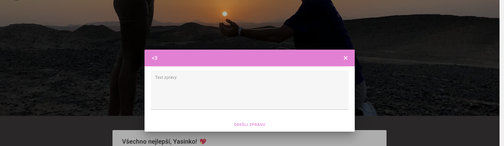

# Yasi-web

This readme covers a small web application that I created as a birthday gift for my lovely girlfriend ❤.

## Getting started
- The app is deployed at [yasi.cz](https://yasi.cz/)
- To log in you can use a test account
    - Login: _`test@gmail.com`_
    - Password: _`password`_

## Built With

- [Vue.js](https://vuejs.org/)
- [TypeScript](https://www.typescriptlang.org/)
- [Firebase](https://firebase.google.com/)

## Screenshots

